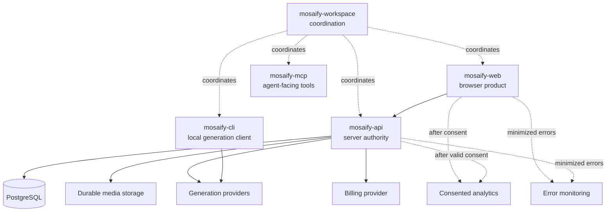

# System map

Mosaify is coordinated from `mosaify-workspace`, but each product repository has its own history and release lifecycle.

## Repository ownership

| Repository | Owns | Does not silently own |
| --- | --- | --- |
| `mosaify-workspace` | Cross-repository conventions, bootstrap, local orchestration, and shared agent workflows | Product implementation or child-repository releases |
| `mosaify-web` | Browser presentation, user interaction, consent UI, and client-side telemetry gating | Billing truth, provider credentials, or authoritative render outcomes |
| `mosaify-api` | Authentication, authorization, persistence, generation orchestration, billing truth, and authoritative lifecycle events | Browser interaction or client-only presentation state |
| `mosaify-cli` | Local client workflows | Web product state or API database ownership |
| `mosaify-mcp` | Provider-agnostic agent tools and contracts | Private server state unless explicitly integrated |

## Cross-repository change rule

When a public contract changes, coordinate the producer and every consumer as separate pull requests. State deployment order and compatibility requirements explicitly. A passing check in one repository does not validate its siblings.
