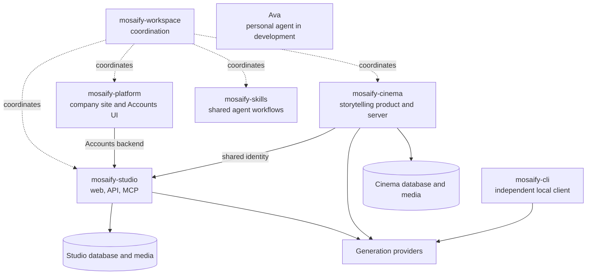

# System map

Repository ownership updated on 3 October 2026. Mosaify is coordinated from
`mosaify-workspace`; each product repository has its own history and release
lifecycle. The workspace coordinates four child repositories: Studio, Platform,
Cinema, and shared skills.

```mermaid
flowchart TB
    Workspace["mosaify-workspace<br/>coordination"]
    Studio["mosaify-studio<br/>web, API, MCP"]
    Platform["mosaify-platform<br/>company site and Accounts UI"]
    Cinema["mosaify-cinema<br/>storytelling product and server"]
    Skills["mosaify-skills<br/>shared agent workflows"]
    CLI["mosaify-cli<br/>independent local client"]
    Ava["Ava<br/>personal agent in development"]
    StudioDB[("Studio database and media")]
    CinemaDB[("Cinema database and media")]
    Provider["Generation providers"]

    Workspace -. "coordinates" .-> Studio
    Workspace -. "coordinates" .-> Platform
    Workspace -. "coordinates" .-> Cinema
    Workspace -. "coordinates" .-> Skills
    Platform --> |"Accounts backend"| Studio
    Cinema --> |"shared identity"| Studio
    Studio --> StudioDB
    Cinema --> CinemaDB
    Studio --> Provider
    Cinema --> Provider
    CLI --> Provider
```

## Repository ownership

| Repository | Owns | Boundary |
| --- | --- | --- |
| `mosaify-workspace` | Cross-repository conventions, bootstrap, local orchestration, and coordination workflows | Product implementation and releases stay with their owners. |
| `mosaify-studio` | Browser product (`apps/web`), authentication, authorization, generation, billing, persistence (`apps/api`), and agent-facing tools (`apps/mcp`) | Browser presentation does not own server authorization, credentials, or billing truth. |
| `mosaify-platform` | Company site, Accounts UI, and shared UI packages | Accounts currently uses Studio's account backend; an independent account service is separate work. |
| `mosaify-cinema` | Storytelling frontend, server, saved projects, media, and generation jobs | Product and project authorization remain separate from shared identity. |
| `mosaify-skills` | Shared provider-neutral development and administrative workflows | Product architecture and release rules remain in the owning repositories. |
| `mosaify-cli` | Independent local client workflows | It does not own web product state or the API database. |
| `Ava` | Active development toward Mosaify's personal agent | Product integration is intended; no production integration is claimed here. |

The archived standalone API, web, and MCP repositories have been superseded by
Studio. Provider checks on 2 October confirmed that API, MCP, and canary
deployment roles trust Studio. Studio and Platform publish frontends by direct
Cloudflare Pages upload; the Pages projects had no GitHub source connection.
Retained cloud names such as `mosaify-web` or `mosaify-api` are independent
resource identities, not source-repository owners. Keep deployed services,
images, data, secrets, and rollback artifacts when retiring source repositories.

## Cross-repository change rule

When a public contract changes, coordinate the producer and every consumer as
separate pull requests. State deployment order and compatibility requirements
explicitly. A passing check in one repository does not validate its siblings.
